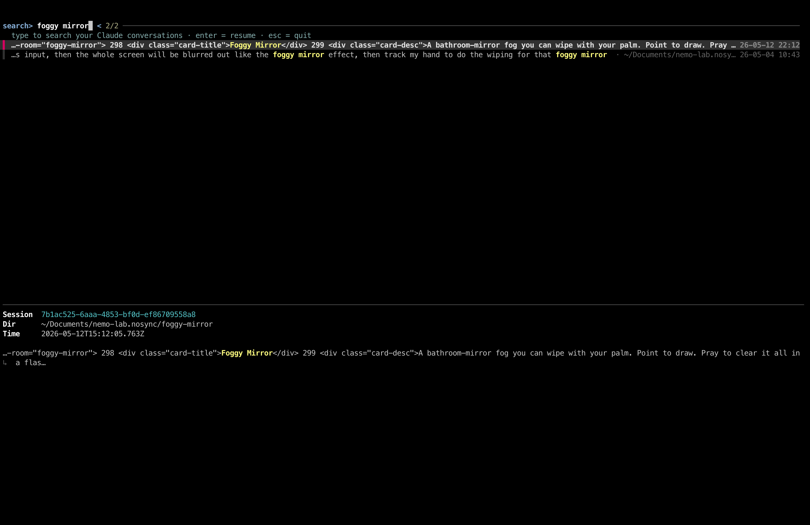

# ccfind

Full-text search over all Claude Code conversations.

Interactive **content search over your Claude Code conversation history**.

## Why

The built-in `claude --resume` picker only matches on a session's name or first
prompt — not on what was discussed *inside* it. Even worse, each `pwd` will have different, fragmented list of conversation. Which lead users to struggle to continue their past work.

## Demo



```
search> rate limiter
  …let's add a token-bucket rate limiter in front of the API gateway…   · ~/code/api-gateway   24-05-30 07:59
  …the rate-limiter test is flaky under load, digging in…              · ~/code/api-gateway ↳ sub-agent   24-05-28 02:49
```


# How 

Claude Code stores every session as a JSONL transcript under
`~/.claude/projects/`. `ccfind` lets you search what was actually *said* across
all of them — type a phrase and matching conversations stream in live, with the
phrase highlighted in context. Press `Enter` on a result to jump straight back
into that conversation (`cd` into its working directory and `claude --resume`).


`ccfind` searches the full
transcript body, so you can find a conversation by something that came up
halfway through it.

## Requirements

- [fzf](https://github.com/junegunn/fzf) ≥ 0.38
- [ripgrep](https://github.com/BurntSushi/ripgrep) (`rg`)
- Python 3.8+
- The `claude` CLI on your `PATH`

On macOS: `brew install fzf ripgrep`

## Install

```sh
git clone https://github.com/coolcorexix/claude-grep
ln -sf "$PWD/ccfind/ccfind" ~/.local/bin/ccfind   # make sure ~/.local/bin is on PATH
```

(Or just copy `ccfind` anywhere on your `PATH`.)

## Usage

```sh
ccfind
```

- **Type** a phrase — results refresh as you type (ripgrep finds candidate
  transcripts, then snippets are extracted and highlighted).
- **↑/↓** to move, **Enter** to resume the selected conversation, **Esc** to quit.
- The preview pane shows the session id, working directory, and timestamp.

Each row shows the matched snippet (phrase highlighted), the conversation's
working directory (dimmed), and the message timestamp (right-aligned).

## How it works

- **Fast:** `rg` narrows 1000s of transcripts to candidates in milliseconds;
  only those files are parsed in Python for clean, highlighted snippets.
- **Searches real content:** your prompts, Claude's replies, and tool results.
  Matches that live *inside* a tool call (e.g. a shell command) still surface via
  a raw fallback.
- **Sub-agent aware:** sub-agent transcripts
  (`<project>/<PARENT-UUID>/subagents/agent-*.jsonl`) can't be resumed directly,
  so `ccfind` resolves them to their **parent** session and resumes that —
  using the parent's working directory (so it still works even if the sub-agent
  ran in a now-deleted worktree).
- **Deduped:** one row per resumable conversation, newest first.

## Limitations

- The right-aligned timestamp is sized to the terminal width at search time; if
  you resize the terminal, alignment corrects on the next keystroke.
- Results are capped (80 most-recent matches per search) to stay responsive.

## License

MIT — see [LICENSE](LICENSE).
